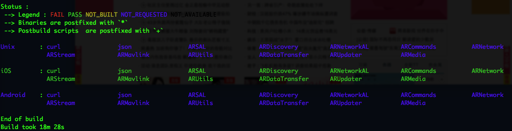

TESTED:

	Mac OSX 10.10.3
	Xcode 6.3.1

Build Result: 

	<SDK>/ARSDKBuildUtils/Targets/iOS
	
	
- - - 
[ERROR] I got `curl` error while building sdk.     
[SOLUTION] remove curl folder and re-run compiling command

